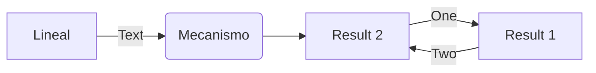
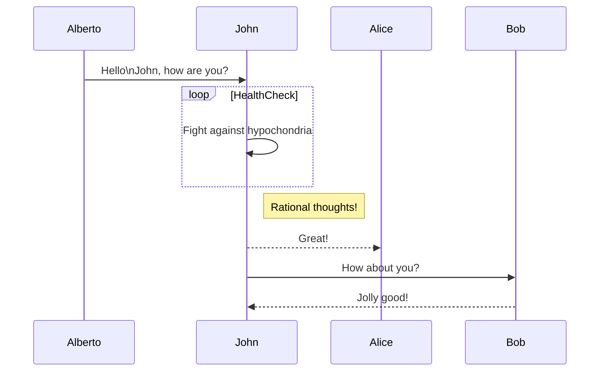

```mermaid
flowchart LR
    A[Lineal] -->|Text| B(Mecanismo)
    B --> C{Circular}
    C -->|One| D[Result 1]
    D -->|Two| C[Result 2]
```

```mermaid
sequenceDiagram
Alberto->>John: Hello\nJohn, how are you?
loop HealthCheck
    John->>John: Fight against hypochondria
end
Note right of John: Rational thoughts!
John-->>Alice: Great!
John->>Bob: How about you?
Bob-->>John: Jolly good!
```